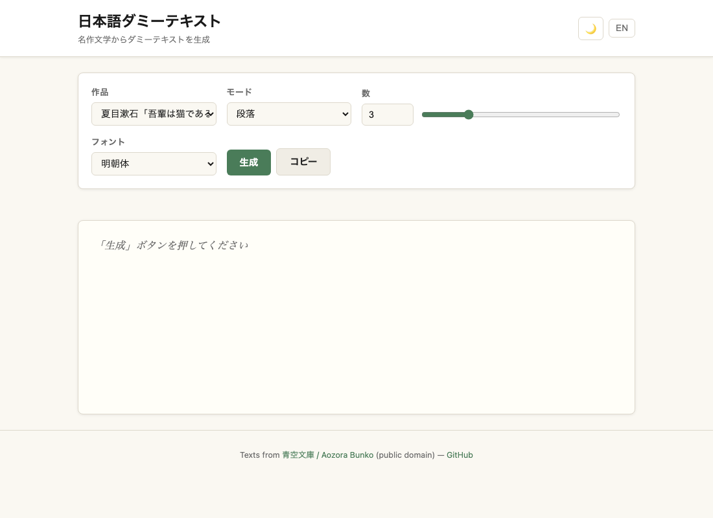

# Lorem JP

[](https://sen.ltd/portfolio/lorem-jp/)

日本語ダミーテキストジェネレータ。夏目漱石・宮沢賢治・太宰治・芥川龍之介・坂口安吾の名作から。

**Live demo**: https://sen.ltd/portfolio/lorem-jp/



## 特徴

- 5 classic literature sources (all public domain)
- Generate by paragraphs (1–10), sentences (1–50), or character count (10–5000)
- One-click copy
- Font family preview: serif / sans-serif / monospace
- Japanese / English UI toggle
- Dark / light theme
- Zero dependencies, no build step

## ソース作品

| 作品 | 著者 |
|------|------|
| 吾輩は猫である | 夏目漱石 |
| 銀河鉄道の夜 | 宮沢賢治 |
| 走れメロス | 太宰治 |
| 羅生門 | 芥川龍之介 |
| 堕落論 | 坂口安吾 |

テキストはすべて著作権保護期間が終了したパブリックドメイン作品です。([青空文庫](https://www.aozora.gr.jp/))

## ローカル起動

```sh
npm run serve
# open http://localhost:8080
```

## テスト

```sh
npm test
```

## ファイル構成

```
lorem-jp/
├── index.html        # Single-page app
├── style.css         # Styles with dark/light theme
├── src/
│   ├── main.js       # DOM events and rendering
│   ├── lorem.js      # Pure generation logic
│   ├── texts.js      # Source text data
│   └── i18n.js       # ja/en translations
├── tests/
│   └── lorem.test.js # 30+ unit tests (node:test)
└── assets/
    └── screenshot.png
```

## ライセンス

MIT. See [LICENSE](./LICENSE).

Source texts from [Aozora Bunko](https://www.aozora.gr.jp/) — public domain.

<!-- sen-publish:links -->
## Links

- 🌐 Demo: https://sen.ltd/portfolio/lorem-jp/
- 📝 dev.to: https://dev.to/sendotltd/japanese-lorem-ipsum-from-5-classic-authors-why-real-text-beats-random-characters-37c8
<!-- /sen-publish:links -->
